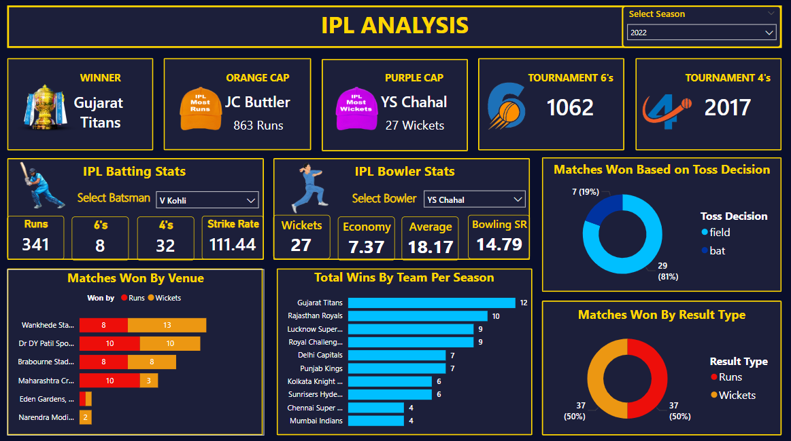

# 🏏 IPL Analysis Dashboard (2008–2022 Seasons)

This Power BI dashboard provides an interactive analysis of Indian Premier League (IPL) seasons from 2008 to 2022. It delivers rich insights into team and player performances, match outcomes, and tournament statistics over the years.

## 📊 Tools & Technologies Used
- **Power BI** for data visualization
- **Excel/CSV** as data source
- **DAX** for calculated columns and measures

---

## 📈 Key Features

### 🏆 Tournament Highlights
- **Winners, Orange Cap, Purple Cap** for each season
- Interactive filters to select and analyze specific seasons

### 📋 Player Performance
- Dynamic selection of batsman and bowler stats
- Key KPIs such as:
  - Runs, 4s, 6s, Strike Rate for batsmen
  - Wickets, Economy, Bowling Average, Strike Rate for bowlers

### 🏟️ Match & Team Analysis
- Total number of 6s & 4s hit in each tournament
- Matches won based on:
  - **Venue**
  - **Toss Decision** (bat/field)
  - **Result Type** (Runs/Wickets)
- Team-wise win distribution across seasons

---

## 📷 Dashboard Preview



---

## 📁 Folder Structure
```
IPL-Dashboard-2008-2022/
├── README.md
├── ipl_data_analysis.pbix
├── ipl_ball_by_ball_2008_2022.csv
├── ipl_matches_2008_2022.csv
├── screenshots/
│   └── ipl_dashboard.png

```

---

## 🔍 How to Use
1. Clone or download the repository.
2. Open `dashboard.pbix` using **Power BI Desktop**.
3. Use the dropdown filter to select a season from 2008 to 2022.
4. Explore the dashboard using interactive visuals.

---

## 💼 Use Cases
- Portfolio project for data visualization
- Sports analytics and fan engagement
- Case study for Power BI learners

---

## 🔗 LinkedIn Post
[🔗 View My LinkedIn Post] *(https://www.linkedin.com/posts/jaishree-gandhi-ab5498357_powerbi-postgresql-dataanalytics-activity-7334573242424156161-4gOd?utm_source=share&utm_medium=member_desktop&rcm=ACoAAFjh9SkBjgY17hZwco9O9omV08GAatAdMaA)*

---

## 📬 Contact
Feel free to connect on [LinkedIn](https://www.linkedin.com/in/jaishree-gandhi-ab5498357/) or email me for any queries or collaboration opportunities.

---
